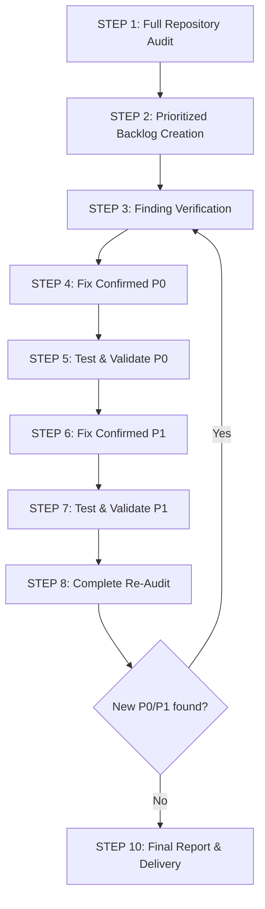

# Full Project Audit & Autonomous Remediation Skill

## Overview

This skill defines an autonomous, production-grade audit and repair workflow for the backend application platform (encompassing backend services, database schema, API contracts, security, and background jobs).

The workflow operates **autonomously end-to-end**. The agent must not stop to ask the user to paste prompts or confirm routine non-destructive steps. It progresses systematically from full audit to backlog generation, verification, prioritized fixing (P0 then P1), comprehensive testing, re-audit, and final report generation.

---

## Core Domain Rules & Invariants

### 1. Financial Invariants (Non-Negotiable)

Every financial operation must strictly preserve mathematical and transactional consistency:

- **INCOME**: Wallet balance increases by the exact transaction amount.
- **EXPENSE**: Wallet balance decreases by the exact transaction amount.
- **TRANSFER**:
  - Source wallet balance decreases by the transfer amount.
  - Destination wallet balance increases by the transfer amount.
  - A transfer MUST NEVER be counted as income or expense in financial summary reports.
- **TRANSACTION UPDATE**:
  - The previous financial effect must be completely reversed before the new effect is applied.
  - If a transaction moves between wallets or categories, both wallets must update accurately within the same transaction.
- **TRANSACTION DELETION**: The exact financial effect on the wallet balance must be reversed.
- **FAILED MUTATION**: If any step in a financial mutation fails, all associated database writes must roll back atomically via `$transaction`.
- **CONCURRENT MUTATIONS**: Concurrent financial operations on the same wallet or budget must not cause lost updates, race conditions, or negative balance anomalies (use atomic SQL updates or database locks).
- **MONEY ACCURACY**: Monetary amounts must ALWAYS use exact precision (`Decimal` in Prisma / PostgreSQL, `Decimal.js` or `Prisma.Decimal` in TypeScript). NEVER cast money to standard JavaScript binary floating-point (`Float` / `number`).
- **OWNERSHIP & IDOR**: NEVER trust `userId` or resource IDs from client inputs (`req.body`, `req.params`). Always authenticate via session/JWT and verify resource ownership at the Service/Repository layer.

### 2. Timezone Standards (`Asia/Ho_Chi_Minh` — UTC+7)

- **Official Business Timezone**: `Asia/Ho_Chi_Minh` (UTC+7).
- **Business Date Fields**: Transaction dates and budget date ranges (`startDate`, `endDate`) represent local business dates.
- **Date Boundary Precision**: Transactions occurring near `00:00:00` or `23:59:59` Vietnam time must belong strictly to the correct local business date.
- **Aggregation & Filtering**: All daily, weekly, monthly, and yearly charts and budget calculations must evaluate time windows based on Vietnam local time boundaries (`00:00:00+07:00` to `23:59:59.999+07:00`).

### 3. Absolute Safety Rules

The agent must **NEVER**:
- Delete live application data or truncate tables.
- Drop or reset the database (`prisma migrate reset` / `db:migrate:reset`).
- Apply destructive migrations that drop columns or tables without explicit user consent.
- Disable authentication, bypass role checks, or weaken password hashing.
- Remove input validation to bypass failing test cases.
- Log, print, or commit secrets, tokens, or environment passwords.
- Disable security controls or rate limiters permanently.

**STOP and request user confirmation ONLY when:**
1. A destructive database schema migration is required.
2. Live production data or external services could be impacted.
3. Secrets, external API credentials, or `.env` configurations need manual intervention.
4. Business requirements are genuinely ambiguous and cannot be safely inferred.
5. A fix requires an architectural rewrite exceeding the scope of the audit.

---

## The 10-Step Autonomous Workflow



---

### STEP 1 — FULL AUDIT

Inspect the complete repository without modifying any code. Evaluate all components against the five review axes (Correctness, Readability, Architecture, Security, Performance).

#### Inspection Matrix:
1. **Architecture & Clean Layering**:
   - Strict separation: `route -> validation -> controller -> service -> repository`.
   - No business logic or database queries in controllers or routes.
   - Consistent error forwarding to global error middleware.
2. **Backend & API Contracts**:
   - HTTP response format consistency (`{ success: true, data, meta }` / `{ success: false, message, code }`).
   - Token delivery for both Web (Cookies) and Mobile / Zalo Mini App (Bearer Token in JSON body).
3. **Authentication & Authorization**:
   - JWT access token / refresh token lifecycle and rotation (RTR).
   - Session revocation upon password reset / password change.
   - Role-based and permission-based access control (`requireAuth`, `requireRole`).
   - Token storage security (SHA-256 hash vs plaintext).
4. **Database, Prisma & PostgreSQL**:
   - Missing foreign key indexes, composite indexes (`[userId, date]`), unique constraints.
   - Soft delete consistency vs unique constraints (e.g. email uniqueness with `deletedAt`).
   - Cascade delete safety (e.g. preventing Role from cascade deleting Users).
   - Migration history completeness (`prisma/migrations/`).
5. **Financial Business Logic**:
   - Precision of monetary fields (`Decimal` vs `Float`).
   - Atomic wallet balance updates during transaction creation, update, and deletion.
   - Transfer transactions isolation from income/expense metrics.
6. **Date & Timezone**:
   - Correct offset conversion between UTC and `Asia/Ho_Chi_Minh` (UTC+7).
   - Midnight boundary conditions (`00:00` and `23:59`).
7. **Performance & Concurrency**:
   - N+1 query patterns in list endpoints.
   - Missing pagination, unbounded query parameters.
   - In-memory memory leaks (e.g. Map without TTL eviction in rate limiters).
8. **Security & Input Validation**:
   - Zod validation coverage across `body`, `query`, and `params`.
   - Protection against password hash leaks in responses.
   - CORS, Rate limiting, Helmet headers.
9. **Dead Code & Leftovers**:
   - Orphaned helper functions, copied boilerplate from unrelated projects.

---

### STEP 2 — CREATE BACKLOG

Convert all audit findings into a structured, prioritized technical backlog.

#### Severity Definitions:
- **P0 - Critical**: Potential data loss, financial calculation errors, critical security vulnerabilities, broken authentication, or system crashes.
- **P1 - High**: Production bugs, business logic errors, authorization / IDOR bugs, unhandled exceptions, severe performance bottlenecks.
- **P2 - Medium**: Edge-case bugs, in-memory leaks, missing parameter validation, timezone boundary inconsistencies, minor race conditions.
- **P3 - Low**: Code quality, dead code removal, duplicate code refactoring, missing automated tests.

#### Backlog Item Format:
```markdown
### `[ID]` Finding Title
- **ID**: P0-01 / P1-01 / P2-01 / P3-01
- **Severity**: P0 | P1 | P2 | P3
- **Module**: Auth | Users | Wallets | Transactions | Budgets | Database | Common
- **File**: `[filename](file:///path/to/file)`
- **Line**: Line numbers
- **Problem**: Concise description of the defect
- **Impact**: Real-world consequence if left unfixed
- **Root Cause**: Underlying architectural or code reason
- **Recommended Fix**: Specific, actionable implementation proposal
- **Required Tests**: Unit / Integration / Regression test specifications
```

---

### STEP 3 — VERIFY FINDINGS

Before modifying code, independently verify every **P0** and **P1** finding. Do not assume the audit was infallible.

1. Trace the complete execution path through routes, middlewares, controllers, services, repositories, and database constraints.
2. Classify each finding into:
   - `CONFIRMED`: Defect is real, reproducible, and requires remediation.
   - `FALSE_POSITIVE`: Code or database constraint already mitigates the issue.
   - `NEEDS_MORE_INVESTIGATION`: Behavior is ambiguous; inspect further or write a reproduction test.
3. **Only `CONFIRMED` findings will be fixed.**

---

### STEP 4 — FIX P0 ISSUES

Remediate all `CONFIRMED` **P0** issues with surgical, minimal, and safe changes.

#### Remediation Guidelines:
- **Minimal Safe Diff**: Change only what is necessary to resolve the defect.
- **Preserve Architecture**: Follow existing project conventions and layered design.
- **Correctness Over Speed**: Ensure financial formulas, transactions, and token flows are completely robust.
- **No Unrelated Changes**: Do not refactor surrounding code during a P0 fix.

---

### STEP 5 — TEST P0 FIXES

Verify all P0 fixes using automated test suites and typechecks.

1. **Run Standard Checks**:
   - TypeScript Typecheck (`pnpm exec tsc --noEmit` or `pnpm build`)
   - Linter (`pnpm run lint`)
   - Schema Validation (`pnpm exec prisma validate`)
2. **Execute & Create Automated Tests**:
   - If tests do not exist for the affected P0 flow, create focused unit/integration tests.
   - Mandatory test scenarios for financial & security fixes:
     - Income / Expense balance mutation accuracy.
     - Atomic rollback on failed database operations.
     - Token revocation upon password change.
     - Password hash exclusion from API responses.
3. If any test fails, diagnose, fix the implementation, and re-run until all tests pass.

---

### STEP 6 — FIX P1 ISSUES

Once all P0 fixes are tested and passing, proceed to fix all `CONFIRMED` **P1** issues following the same discipline:
- Resolve database indexing and missing migration baselines.
- Hash sensitive tokens before database persistence.
- Enforce token lifecycle and session revocation.
- Harden environment configuration and secret fallbacks.

---

### STEP 7 — TEST P1 FIXES

Run the full validation suite:
- TypeScript compilation (`pnpm build`).
- Linter checks (`pnpm run lint`).
- Unit & Integration test suite (`pnpm test`).
- Database migration status (`pnpm run db:migrate:status` / `prisma validate`).

Ensure zero regressions across both backend and frontend contracts.

---

### STEP 8 — COMPLETE RE-AUDIT

Perform an independent secondary audit across the entire codebase to verify:
- Were all original P0 and P1 issues completely resolved?
- Did any fix introduce new bugs or regressions?
- Are financial invariants and precision intact?
- Are timezone calculations (`Asia/Ho_Chi_Minh`) preserved?
- Are API contracts backwards-compatible with Mini App clients?

---

### STEP 9 — SECONDARY FIXES & CONVERGENCE LOOP

If the re-audit uncovers new `CONFIRMED` P0 or P1 issues introduced during remediation:
1. Re-enter the **VERIFY → FIX → TEST → RE-AUDIT** cycle.
2. Limit iterations to prevent circular edits.
3. Stop when:
   - 0 Confirmed P0 issues remain.
   - 0 Confirmed P1 issues remain.
   - All tests, builds, and linters pass cleanly.

---

### STEP 10 — FINAL REPORT & DELIVERY

Generate a comprehensive audit and remediation report saved to:
`docs/audits/latest-audit.md`

#### Report Structure:

```markdown
# Application Production Audit & Remediation Report

**Date**: YYYY-MM-DD HH:mm:ss (UTC+7)
**Status**: COMPLETED / CONVERGED
**Branch / Commit**: <git commit / branch>

## Executive Summary
High-level overview of findings, fixed vulnerabilities, financial accuracy improvements, and system health status.

## Initial Findings Summary
Table showing count of P0, P1, P2, P3 findings discovered during the initial audit.

## Resolved & Fixed Issues

### P0 Fixes
For each fixed P0 issue:
- **Finding ID**: P0-XX
- **Title**: ...
- **Root Cause**: ...
- **Fix Applied**: Summary of code change
- **Files Modified**: Clickable markdown links `[file](file:///...)`
- **Tests Added / Run**: Test details and assertions
- **Verification Result**: CONFIRMED RESOLVED

### P1 Fixes
(Same structure as P0)

## Re-Audit & Verification Results
Detailed comparison between initial state and post-remediation state.

## Remaining & Deferred Issues (P2 / P3)
List of non-blocking P2 and P3 issues scheduled for future maintenance.

## Changed Files Summary
List of all modified and created files with brief explanations.

## Risk Assessment & Deployment Notes
Operational guidance, database migration instructions, and environment variable requirements for production deployment.
```

---

## Final Executive Output

Upon completing the entire workflow, the agent must output a concise summary in the conversation containing:
- **P0 Fixed**: Number and list of resolved critical issues.
- **P1 Fixed**: Number and list of resolved high-priority issues.
- **P2 / P3 Remaining**: Summary of deferred minor items.
- **Tests Executed**: Passed / Failed test summary.
- **Files Changed**: List of modified files.
- **Remaining Risks**: Any operational considerations for deployment.
