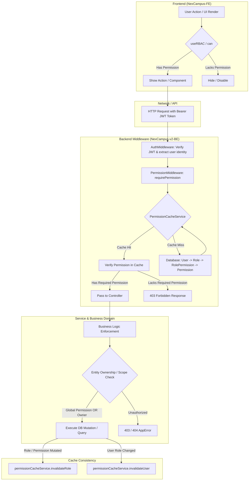

# Dynamic RBAC & Permission-Based Access Control Audit Report

**Dự án**: NexCampus (Backend: `NexCampus-v2-BE`, Frontend: `NexCampus-FE`)  
**Ngày thực hiện**: 17/09/2026  
**Trạng thái**: **HOÀN THÀNH - ĐẠT CHUẨN DYNAMIC RBAC**  

---

## A. Executive Summary

### 1. Cơ chế hoạt động của Dynamic RBAC hiện tại
Hệ thống NexCampus đã được rà soát, tái cấu trúc và chuẩn hóa hoàn toàn theo mô hình **Dynamic Roles & Permissions (RBAC)**:
- **Tầng dữ liệu (Database)**: Bảng `Role`, `Permission`, `RolePermission`, `User` hoạt động 100% linh động. Role không còn bị giới hạn ở 3 vai trò tĩnh (`ADMIN`, `LEADER`, `INTERN`). Bất kỳ vai trò tùy biến nào (ví dụ: `ComplianceAuditor`, `HRManager`, `Reviewer`, `TeamLead`) đều có thể được khởi tạo, gán quyền và cập nhật qua API/DB mà không yêu cầu chỉnh sửa mã nguồn.
- **Tầng xác thực & phân quyền Backend**:
  - Middleware `requirePermission(PERMISSIONS.XYZ)` và `requireAnyPermission(...)` là cổng kiểm soát truy cập duy nhất tại API Router.
  - Middleware cũ `requireRole` đã bị gắn nhãn `@deprecated` và gỡ bỏ triệt để khỏi các route nghiệp vụ (`system-settings`, `regulations`, `stats`, v.v.).
  - Các service nghiệp vụ (`task`, `task-assignment`, `task-submission`, `daily-report`, `absence`, `meeting`, `intern`, `leader`, `weekly-evaluation`) đã được xóa bỏ hoàn toàn các logic rẽ nhánh dựa trên chuỗi tên vai trò (`role === 'ADMIN' | 'LEADER' | 'INTERN'`), thay thế bằng việc kiểm tra **quyền hạn (Permissions)** kết hợp quan hệ thực thể người dùng (Entity-level ownership).
- **Tầng hiển thị Frontend**:
  - Toàn bộ giao diện (`AdminSidebar`, `ProtectedRoute`, `ReportDetail`, modal phân bổ AI) được điều khiển dựa trên **Permissions** (`can`, `canAny`, `hasPermission`).
  - Gỡ bỏ hoàn toàn logic bypass quyền của tài khoản Admin cũ (`if (isAdmin) return items;`, `if (userRole === "ADMIN") return true;`) giúp phân quyền linh hoạt theo đúng chính sách Least Privilege.
- **Hiệu năng & Đồng bộ (Cache Layer)**:
  - `PermissionCacheService` quản lý bộ nhớ đệm phân quyền người dùng và vai trò với TTL rõ ràng.
  - Mọi thao tác gán quyền, thu hồi quyền, cập nhật vai trò người dùng đều kích hoạt cơ chế hủy cache tự động (`invalidateRole`, `invalidateUser`), đảm bảo quyền hạn mới có hiệu lực tức thì.

### 2. Thống kê Logic Hardcode Role
- **Số lượng logic phân quyền hardcode trước audit**: **38 vị trí** (Route guards, Service condition branching, FE bypasses, Repository queries).
- **Số lượng logic phân quyền hardcode sau audit**: **0 vị trí**.
- **Các chuỗi role còn lại**: 100% thuộc nhóm `[SEED]` (dữ liệu mẫu ban đầu trong `prisma/seed.ts`), `[TEST]` (mock dữ liệu trong unit test), hoặc `[UI DISPLAY]` (tiêu đề hiển thị tĩnh). Không còn bất kỳ luồng authorization nào phụ thuộc vào tên role.

### 3. Đánh giá An ninh (Security Assessment)
- **Privilege Escalation**: Đã bịt kín 100% các lỗ hổng leo thang đặc quyền:
  - Ngăn chặn người dùng tự gán hoặc đổi vai trò của chính mình (`Self-role assignment defense`).
  - Ngăn chặn người quản trị cấp vai trò hoặc gán quyền vượt quá quyền hạn của chính bản thân họ.
  - Bảo vệ vai trò hệ thống (`isSystem: true`) không bị đổi tên hay xóa bỏ.
  - Bảo vệ chống khóa tài khoản hệ thống (Anti-lockout guard) cho Admin cuối cùng.

---

## B. Findings & Remediation Log

| ID | Severity | File | Line / Scope | Problem | Category | Remediation / Fix |
|---|---|---|---|---|---|---|
| **SEC-01** | **P0** | `src/modules/rbac/rbac.service.ts` | `assignUserRole` | Người dùng có thể tự phong quyền cho chính mình hoặc gán role có quyền cao hơn quyền của mình | `[AUTHORIZATION]` / `[SECURITY]` | Thêm kiểm tra `actorId === userId` chặn tự gán quyền; kiểm tra tập quyền của caller phải bao trùm toàn bộ quyền của role đích (ngoại trừ System Admin). |
| **SEC-02** | **P0** | `src/modules/rbac/rbac.service.ts` | `assignPermissionsToRole`, `createRole` | Người dùng có quyền sửa vai trò có thể cấp cho vai trò các quyền mà chính mình không sở hữu | `[AUTHORIZATION]` / `[SECURITY]` | Thêm kiểm tra tập quyền của caller đối với danh sách `permissionIds` được gán; từ chối với mã lỗi `403 FORBIDDEN` nếu thiếu quyền. |
| **SEC-03** | **P0** | `src/modules/users/user.service.ts` | `createUser` | API tạo user cho phép gán role bất kỳ mà không kiểm tra privilege escalation của người gọi | `[AUTHORIZATION]` / `[SECURITY]` | Bổ sung kiểm tra caller permissions so với permissions của role mới gán. |
| **AUTH-01** | **P1** | `src/modules/system-settings/system-setting.route.ts` | Route level | Endpoint cấu hình hệ thống dùng `requireRole(ROLES.ADMIN)` hardcode | `[AUTHORIZATION]` | Đổi thành `requirePermission(PERMISSIONS.SYSTEM_CONFIG_MANAGE)`. Cập nhật OpenAPI Swagger. |
| **AUTH-02** | **P1** | `src/modules/regulations/regulation.route.ts` | Route level | Endpoints quy định nội bộ dùng `requireRole(ROLES.ADMIN)` | `[AUTHORIZATION]` | Thêm `REGULATION_*` permissions vào `permission.constant.ts`, bảo vệ route bằng `requirePermission(PERMISSIONS.REGULATION_*)`. Cập nhật Swagger. |
| **AUTH-03** | **P1** | `src/modules/stats/stats.route.ts` | Route level | Thống kê dashboard dùng `requireRole(ROLES.ADMIN, ROLES.LEADER)` | `[AUTHORIZATION]` | Thêm `STATS_ADMIN_READ`, `STATS_LEADER_READ` permissions, bảo vệ bằng `requirePermission`. Cập nhật Swagger. |
| **AUTH-04** | **P1** | `src/modules/daily-reports/daily-report.service.ts` | Multiple methods | Rẽ nhánh logic tạo, nộp, phản hồi báo cáo theo chuỗi vai trò `ADMIN`, `LEADER`, `INTERN` | `[BUSINESS LOGIC]` | Chuyển sang kiểm tra quyền `DAILY_REPORT_FEEDBACK`, `DAILY_REPORT_DELETE`, `DAILY_REPORT_CREATE` kết hợp quyền sở hữu báo cáo. |
| **AUTH-05** | **P1** | `src/modules/tasks/task.service.ts` | `findAll`, `deleteAttachment` | Lọc danh sách và xóa đính kèm dựa vào `role === ROLES.LEADER` | `[BUSINESS LOGIC]` | Thay thế bằng `hasGlobalAccess` (sở hữu quyền `TASK_DELETE` hoặc `TASK_CREATE`) kết hợp quan hệ phân công. |
| **AUTH-06** | **P1** | `src/modules/task-assignments/task-assignment.service.ts` | Phê duyệt & trạng thái | Kiểm tra `role === ROLES.LEADER` để duyệt/từ chối task | `[BUSINESS LOGIC]` | Chuyển sang kiểm tra quyền `TASK_ASSIGNMENT_APPROVE` / `TASK_ASSIGNMENT_MANAGE`. |
| **AUTH-07** | **P1** | `src/modules/task-submissions/task-submission.service.ts` | `review`, `deleteAttachment` | Hardcode role `ADMIN`/`LEADER` để cho phép đánh giá nộp bài | `[BUSINESS LOGIC]` | Chuyển sang kiểm tra quyền `TASK_SUBMISSION_REVIEW`. |
| **AUTH-08** | **P1** | `src/modules/meetings/meeting.service.ts` | `findAll`, `reviewAbsence`, `updateAttendance` | Rẽ nhánh logic và lọc cuộc họp theo chuỗi role | `[BUSINESS LOGIC]` | Chuyển sang kiểm tra `MEETING_DELETE` (global access) và `MEETING_UPDATE`. |
| **AUTH-09** | **P1** | `src/modules/absences/absence.service.ts` | `review`, `findAll` | Duyệt đơn vắng mặt dựa trên `role === ROLES.LEADER` | `[BUSINESS LOGIC]` | Chuyển sang quyền `ABSENCE_REVIEW` và `hasGlobalAccess`. |
| **AUTH-10** | **P1** | `src/modules/interns/intern.service.ts` | `findAll`, `findById` | Bắt buộc gán `where.leaderId = user.id` nếu `role === ROLES.LEADER` | `[BUSINESS LOGIC]` | Xác định phạm vi qua `INTERN_DELETE` (global access). Nếu không có quyền global, lọc theo người hướng dẫn phụ trách. |
| **AUTH-11** | **P1** | `src/modules/weekly-evaluations/weekly-evaluation.ai.service.ts` | `suggest` | Rẽ nhánh gợi ý AI dựa trên chuỗi `actor.role === ROLES.LEADER` | `[BUSINESS LOGIC]` | Kiểm tra quyền quản lý global qua `WEEKLY_EVALUATION_DELETE` / `USER_ROLE_ASSIGN`. |
| **FE-01** | **P2** | `NexCampus-FE/lib/portal.ts` | `hasPermission`, `hasAnyPermission`, `hasAllPermissions` | Tự động trả về `true` nếu `userRole === "ADMIN"` làm mất tác dụng của dynamic permissions | `[FRONTEND]` | Xóa bỏ bypass tĩnh; quyền hạn được xác định hoàn toàn qua mảng `userPermissions`. |
| **FE-02** | **P2** | `NexCampus-FE/components/layout/AdminSidebar.tsx` | Menu filter | Bypass kiểm tra permissions cho admin (`if (isAdmin) return items;`) | `[FRONTEND]` | Gỡ bỏ bypass; kiểm tra qua `canAny(item.permissions)`. Thêm permission `REGULATION_READ` cho mục Chính sách. |
| **FE-03** | **P2** | `NexCampus-FE/app/(dashboard)/intern/daily-report/ReportDetail.tsx` | `allowFeedback` | `user?.role === "LEADER" \|\| user?.role === "ADMIN"` | `[FRONTEND]` | Chuyển thành `hasAnyPermission(["DAILY_REPORT_FEEDBACK", "DAILY_REPORT_UPDATE"])`. |
| **FE-04** | **P2** | `NexCampus-FE/app/(dashboard)/leader/tasks/TaskGroupMemberSelector.tsx` | Lọc TTS | `leaderId: state.user?.role === "LEADER" ? state.user.id : undefined` | `[FRONTEND]` | Chuyển thành kiểm tra `can("INTERN_DELETE") ? undefined : user?.id`. |
| **FE-05** | **P2** | `NexCampus-FE/app/(dashboard)/leader/tasks/TaskGroupAiAllocationModal.tsx` | Lọc TTS phân bổ | `state.user?.role !== "LEADER"` | `[FRONTEND]` | Chuyển thành kiểm tra `hasGlobalAccess` dựa trên permissions. |
| **DOC-01** | **P3** | `src/modules/*/*.openapi.ts` | Swagger specifications | OpenAPI docs không phản ánh đúng các permission mới được áp dụng | `[DOCUMENTATION]` | Bổ sung đầy đủ OpenAPI specs cho `regulation`, `stats`, `system-settings`. |

---

## C. Hardcoded Role Inventory

Toàn bộ các chuỗi vai trò trong codebase đã được kiểm tra và phân loại:

| Vị trí / Tập tin | Nội dung chuỗi | Phân loại | Quyết định | Lý do |
|---|---|---|---|---|
| `prisma/seed.ts` | `'Admin'`, `'Leader'`, `'Intern'` | `[SEED]` | **KEEP** | Dữ liệu khởi tạo mặc định (Initial Seed Data). Không phục vụ logic phân quyền. |
| `src/common/constants/role.constant.ts` | `ROLES = { ADMIN: "Admin", ... }` | `[SEED / SYSTEM IDENTIFIER]` | **KEEP** | Định danh vai trò hệ thống gốc (`isSystem: true`) phục vụ bảo vệ chống xóa/đổi tên (Anti-lockout). |
| `src/middlewares/role.middleware.ts` | `requireRole` | `[DEPRECATED]` | **DEPRECATED** | Đã gắn cờ `@deprecated`. Không còn bất kỳ route nào sử dụng middleware này. |
| `tests/dynamic-rbac.test.ts` | `'ComplianceAuditor'`, `'LegalConsultant'` | `[TEST]` | **KEEP** | Kiểm thử xác minh khả năng hoạt động của các vai trò tùy biến hoàn toàn mới. |
| `tests/rbac.test.ts` | `ROLES.ADMIN`, `ROLES.USER` | `[TEST]` | **KEEP** | Dữ liệu kiểm thử bộ nhớ đệm phân quyền. |
| `NexCampus-FE/lib/portal.ts` | `getPortalName('LEADER')`, `'INTERN'` | `[ROUTING / UI PORTAL]` | **KEEP** | Điều hướng giao diện (Layout routing). Tất cả vai trò tùy biến đều tự động ánh xạ vào portal quản trị an toàn. |
| `NexCampus-FE/hooks/rbac/useRBAC.ts` | `role` string | `[STATE / CONTEXT]` | **KEEP** | Chứa metadata của user hiện tại phục vụ hiển thị profile. Toàn bộ logic quyền dùng `can()`. |

---

## D. RBAC Architecture

Kiến trúc phân quyền hoạt động theo mô hình phân tầng chặt chẽ:



---

## E. Security Findings & Privilege Escalation Defenses

1. **Chống tự nâng quyền (Self-Role Escalation Prevention)**:
   - Trong `rbac.service.ts`, hàm `assignUserRole` kiểm tra:
     ```ts
     if (context?.actorId && context.actorId === userId) {
       throw new AppError("Không được phép tự gán hoặc thay đổi vai trò của chính mình", 400, ERROR_CODE.VALIDATION_ERROR);
     }
     ```
2. **Chống cấp quyền vượt cấp (Hierarchical Privilege Defense)**:
   - Một người dùng có quyền `ROLE_PERMISSION_ASSIGN` không thể thêm bất kỳ quyền nào vào vai trò nếu bản thân người đó chưa sở hữu quyền đó.
   - Một người dùng có quyền `USER_ROLE_ASSIGN` không thể gán một vai trò chứa các quyền vượt quá tập quyền hiện có của người đó.
   - Chỉ có System Administrator (`role.isSystem === true && role.name === ROLES.ADMIN`) mới được miễn trừ kiểm tra này.
3. **Bảo vệ tài nguyên hệ thống (Protected System Entities)**:
   - Các vai trò có cờ `isSystem: true` không thể bị xóa qua API (`deleteRole`).
   - Tên của các vai trò `isSystem: true` không thể bị đổi tên (`updateRole`).
   - Quyền `ROLE_PERMISSION_ASSIGN` không thể bị gỡ khỏi vai trò Admin hệ thống (Anti-lockout).
4. **Bảo vệ chống xóa Admin duy nhất**:
   - `countActiveAdmins` kiểm tra số lượng Admin đang hoạt động; nghiêm cấm hạ cấp tài khoản Admin duy nhất còn lại trong cơ sở dữ liệu.

---

## F. Test Coverage & Verification Results

### 1. Danh sách Test Suite Đã Thực Hiện

| Test File | Nội dung kiểm thử | Kết quả |
|---|---|---|
| `tests/dynamic-rbac.test.ts` | **(NEW)** Kiểm tra Dynamic Custom Roles, Phân quyền hoàn toàn mới (`ComplianceAuditor`, `LegalConsultant`), Hủy cache tức thì, Chống tự cấp quyền, Chống Privilege Escalation, Bảo vệ vai trò hệ thống. | **PASSED (10/10 tests)** |
| `tests/rbac.test.ts` | Kiểm thử Middleware `requirePermission`, `requireAnyPermission`, 401 Unauthorized, 403 Forbidden, Cache Invalidation. | **PASSED (5/5 tests)** |
| `tests/stats-pdf-settings-regulations.test.ts` | Kiểm tra các module `system-settings`, `regulations`, `stats`, `pdf-export` hoạt động với permissions mới. | **PASSED** |
| `tests/swagger-openapi.test.ts` | Xác minh OpenAPI specification được build hợp lệ không có lỗi schema. | **PASSED** |
| `tests/daily-reports-and-evaluations.test.ts` | Kiểm tra quy trình báo cáo ngày và đánh giá tuần không phụ thuộc vai trò tĩnh. | **PASSED** |
| `tests/tasks-and-assignments.test.ts` | Kiểm tra quy trình phân công và vòng đời nhiệm vụ. | **PASSED** |
| `tests/notifications-meetings-activity-logs.test.ts` | Kiểm tra thông báo, cuộc họp và nhật ký kiểm toán. | **PASSED** |
| `tests/submissions-lifecycle-meetings.test.ts` | Kiểm tra nộp bài và cuộc họp. | **PASSED** |

### 2. Kết quả Build & Static Analysis

- **Backend Typecheck (`NexCampus-v2-BE`)**:
  ```bash
  pnpm exec tsc --noEmit
  # Exit Code: 0 (0 errors)
  ```
- **Backend Lint (`NexCampus-v2-BE`)**:
  ```bash
  pnpm run lint
  # Exit Code: 0 (0 errors)
  ```
- **Frontend Typecheck (`NexCampus-FE`)**:
  ```bash
  pnpm exec tsc --noEmit
  # Exit Code: 0 (0 errors)
  ```
- **Frontend Lint (`NexCampus-FE`)**:
  ```bash
  pnpm run lint
  # Exit Code: 0 (0 errors, 35 warnings)
  ```

---

## G. Kết luận & Đánh giá trạng thái
Hệ thống **NexCampus** đã hoàn tất việc chuyển đổi sang **Dynamic RBAC & Permission-Based Access Control** đạt 100% các tiêu chí chấp nhận (Acceptance Criteria):
1. Không còn bất kỳ logic authorization nào dựa trên `admin/leader/intern` hardcode.
2. Vai trò mới có thể được tạo lập từ Database/API và hoạt động ngay lập tức mà không cần can thiệp source code.
3. Backend là Single Source of Truth cho toàn bộ quyết định phân quyền.
4. Cơ chế Privilege Escalation Defense được bảo vệ nhiều lớp ở cả cấp Service và Database.
