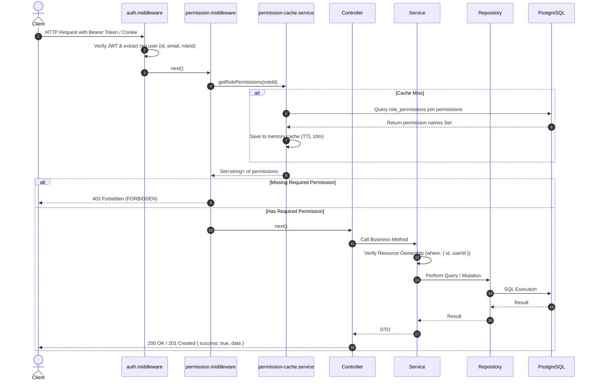

# Dynamic RBAC Architecture & Design Specification

**Document**: `docs/security/dynamic-rbac-design.md`  
**Version**: 1.0.0  
**Target**: `template-be`

---

## 1. Architectural Concept

Dynamic Role-Based Access Control (RBAC) decouples permission enforcement from role identifiers.

```text
User ──(1:1)──> Role ──(1:N)──> RolePermission ──(N:1)──> Permission
```

1. **Permission**: An atomic authorization capability named using the standard `RESOURCE_ACTION` format (e.g. `USER_CREATE`, `WALLET_READ`, `ROLE_PERMISSION_ASSIGN`).
2. **Role**: A named collection of permissions (e.g. `ADMIN`, `MANAGER`, `USER`, `ACCOUNTANT`, `AUDITOR`). Roles can be dynamically created, updated, and deleted through administrative APIs.
3. **User**: Assigned a single role (`roleId`) which grants the full set of effective permissions mapped to that role.
4. **Middleware Enforcement**: Route guards use `requirePermission('RESOURCE_ACTION')` rather than checking hardcoded role names.
5. **Ownership Enforcement**: The Service layer verifies resource ownership (`userId`) in parallel to capability authorization, mitigating IDOR risks.

---

## 2. Dynamic RBAC Data Flow



---

## 3. Standard Permission Catalog

| Resource | Action | Permission Name | Description |
| :--- | :--- | :--- | :--- |
| `USER` | `READ` | `USER_READ` | View user list and profile details |
| `USER` | `CREATE` | `USER_CREATE` | Create new user accounts |
| `USER` | `UPDATE` | `USER_UPDATE` | Update user status and roles |
| `USER` | `DELETE` | `USER_DELETE` | Soft delete user accounts |
| `WALLET` | `READ` | `WALLET_READ` | View wallet details and balance |
| `WALLET` | `CREATE` | `WALLET_CREATE` | Create new wallet |
| `WALLET` | `UPDATE` | `WALLET_UPDATE` | Update wallet information |
| `WALLET` | `DELETE` | `WALLET_DELETE` | Delete wallet |
| `TRANSACTION` | `READ` | `TRANSACTION_READ` | View transaction history |
| `TRANSACTION` | `CREATE` | `TRANSACTION_CREATE` | Create income/expense/transfer transaction |
| `TRANSACTION` | `UPDATE` | `TRANSACTION_UPDATE` | Edit existing transaction |
| `TRANSACTION` | `DELETE` | `TRANSACTION_DELETE` | Delete transaction |
| `CATEGORY` | `READ` | `CATEGORY_READ` | View categories |
| `CATEGORY` | `CREATE` | `CATEGORY_CREATE` | Create custom category |
| `CATEGORY` | `UPDATE` | `CATEGORY_UPDATE` | Edit category |
| `CATEGORY` | `DELETE` | `CATEGORY_DELETE` | Delete category |
| `BUDGET` | `READ` | `BUDGET_READ` | View budgets and progress |
| `BUDGET` | `CREATE` | `BUDGET_CREATE` | Set budget |
| `BUDGET` | `UPDATE` | `BUDGET_UPDATE` | Edit budget |
| `BUDGET` | `DELETE` | `BUDGET_DELETE` | Remove budget |
| `REPORT` | `READ` | `REPORT_READ` | View financial analytics and reports |
| `ROLE` | `READ` | `ROLE_READ` | View roles and role permissions |
| `ROLE` | `CREATE` | `ROLE_CREATE` | Create new custom roles |
| `ROLE` | `UPDATE` | `ROLE_UPDATE` | Edit role information |
| `ROLE` | `DELETE` | `ROLE_DELETE` | Delete non-system roles |
| `PERMISSION` | `READ` | `PERMISSION_READ` | View system permission catalog |
| `ROLE_PERMISSION` | `ASSIGN` | `ROLE_PERMISSION_ASSIGN` | Assign/revoke permissions to/from roles |
| `AUDIT_LOG` | `READ` | `AUDIT_LOG_READ` | View security and RBAC audit logs |

---

## 4. System Protection Invariants

1. **System Roles Invariant**:
   - `Role.isSystem`: Roles created by the system (`ADMIN`, `MANAGER`, `USER`) have `isSystem = true` and cannot be deleted or renamed.
2. **Administrator Anti-Lockout Invariant**:
   - The `ADMIN` role cannot have the `ROLE_PERMISSION_ASSIGN` permission revoked.
   - An administrator cannot soft-delete themselves or remove their own administrative role if they are the sole administrator.
3. **Cache Invalidation Invariant**:
   - Whenever permissions for a role are mutated, `permissionCache.invalidateRole(roleId)` must be invoked immediately to guarantee fresh authorization states across subsequent requests.
