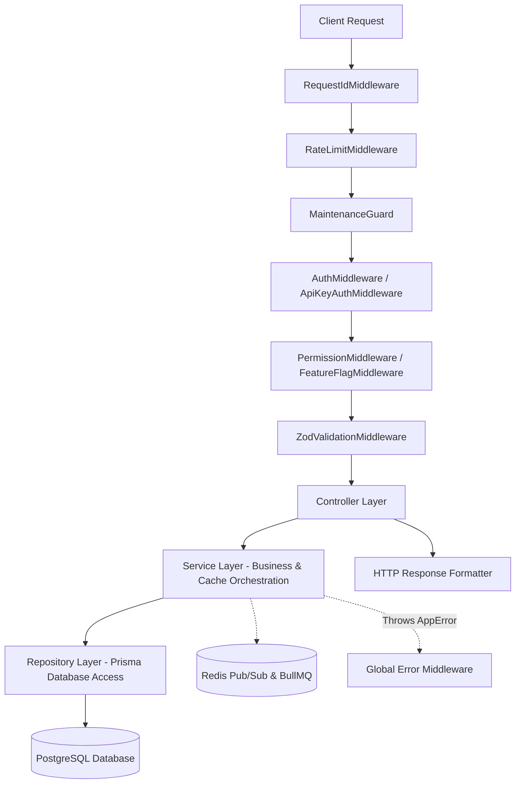

# Backend Template Architecture & Layering Reference

**Repository**: `template-be`  
**Version**: 1.0.0 (Production-Grade Template)  
**Primary Language & Runtime**: Node.js, Express, TypeScript (Strict Mode), PostgreSQL, Prisma ORM, Redis (Optimization & Pub/Sub)  

---

## 1. Architectural Blueprint & Philosophy

`template-be` implements a **Modular Layered Architecture** with strict layer encapsulation and explicit unidirectional dependency flow.



---

## 2. Layer Boundaries & Responsibilities

### 1. Routes Layer (`src/modules/*/*.route.ts` & `src/routes/*.ts`)
- **Responsibility**: Declares HTTP endpoints, URL parameters, methods, and chains middlewares in strict order.
- **Constraints**: Never executes database queries or contains business decisions.

### 2. Validation Layer (`src/modules/*/*.validation.ts`)
- **Responsibility**: Defines strict Zod schemas for `body`, `query`, `params`.
- **Normalization**: Coerces dates, trims strings, strips unexpected properties, validates UUIDs, and protects against parameter pollution.

### 3. Controller Layer (`src/modules/*/*.controller.ts`)
- **Responsibility**: Extracts validated data, extracts user context (`req.user`), delegates to service layer, and returns consistent HTTP response `{ success: true, data, meta }`.
- **Constraints**: Forwards all unhandled exceptions directly to `next(error)`. No Prisma queries or hashing in controllers.

### 4. Service Layer (`src/modules/*/*.service.ts` & `src/common/services/*.ts`)
- **Responsibility**: Business logic, domain rules, transaction boundaries (`prisma.$transaction`), in-memory cache coordination, and event dispatching.
- **Error Handling**: Uses `AppError` paired with `ERROR_CODE` constants.

### 5. Repository Layer (`src/modules/*/*.repository.ts`)
- **Responsibility**: Single point of contact with PostgreSQL via Prisma Client.
- **Data Safety**: Oomits sensitive password hashes, applies soft delete filters (`deletedAt: null`), handles pagination and database indexes.

---

## 3. Directory Layout & Module Structure

```text
src/
├── server.ts                    # Application startup, config seeding, graceful shutdown
├── app.ts                       # Express app configuration & global middleware pipeline
├── routes/
│   ├── index.ts                 # /api/v1 router aggregation
│   └── health.route.ts          # Liveness & deep readiness probes
├── modules/
│   ├── auth/                    # Authentication, tokens, sessions, password reset, avatar
│   ├── users/                   # User management CRUD & soft delete
│   ├── rbac/                    # Dynamic roles, permissions, audit logs
│   ├── system-config/           # Dynamic system configuration & Feature flags
│   ├── maintenance/             # Maintenance mode & public status
│   ├── notification/            # In-app notifications & email queue & templates
│   └── integration/             # API Keys & Webhook endpoints & delivery worker
├── middlewares/
│   ├── request-id.middleware.ts # X-Request-Id correlation tracing
│   ├── rate-limit.middleware.ts # Sliding-window rate limiters (Global + Auth)
│   ├── maintenance.middleware.ts# Maintenance guard & multi-tier bypass
│   ├── auth.middleware.ts       # JWT Bearer token & cookie extractor
│   ├── api-key.middleware.ts    # Third-party integration API Key verification
│   ├── permission.middleware.ts # Dynamic RBAC permission guards
│   ├── feature-flag.middleware.ts# Route-level feature flag gating
│   ├── validate.middleware.ts   # Zod HTTP boundary validation
│   └── error.middleware.ts      # Global error handler & Prisma error mapper
├── config/
│   ├── env.config.ts            # Strongly validated environment configuration
│   ├── swagger.config.ts        # OpenAPI 3.0 specs & Swagger UI
│   ├── jwt.config.ts            # JWT token secret and expiration config
│   ├── mail.config.ts           # SMTP and email service config
│   └── r2.config.ts             # Cloudflare R2 / S3 storage config
├── database/
│   └── prisma.client.ts         # Singleton Prisma Client instance
└── common/
    ├── constants/               # Centralized as-const constants & exported types
    ├── errors/                  # AppError class & ERROR_CODE definitions
    ├── helpers/                 # URL SSRF defense, crypto, date/timezone, IP utilities
    ├── services/                # MailService, PermissionCache, MaintenanceCache, R2Service
    ├── queues/                  # BullMQ Webhook Queue
    └── workers/                 # EmailWorker, WebhookWorker
```
